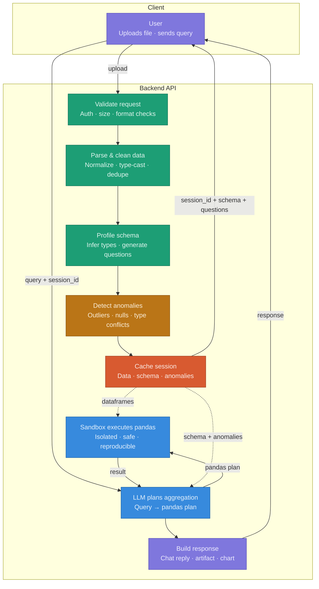

# BI Tool

AI-assisted BI: upload CSV/XLSX, profile data, chat/ask for metrics or charts, get artifacts, and share.

## Architecture (high-level)

## Request lifecycles
- Upload: validate size/type → parse & sanitize → profile schema/anomalies → store DFs in session → return `session_id`, schema summary, starter questions.
- Query: get session → build strict JSON prompt (Claude) with schema only → execute returned pandas code in sandbox → inject RESULT_VALUE/RESULT_DATA → return chat, artifact HTML, citations, warnings.

## Data handling & safety
- Raw rows never leave the server; Claude sees schema/stats, not data.
- Upload guardrails: 100 MB max, CSV/XLSX only, multi-file ok.
- Execution: AST allowlist, blacklist of dangerous names, subprocess sandbox, threads pinned, 30s timeout, results truncated to MAX_RESULT_ROWS before serialization.
- Artifacts: HTML uses RESULT_DATA placeholder; backend injects real JSON before sending to client.

## Duplicate IDs / merge policy (model guidance)
- Add `source` per file, concat, dedup by `id` (prefer latest by `updated_at`; if absent, keep row with most non-null fields).
- Numerics: sum across duplicates. Text: keep last.
- Conflicts: also emit a small conflicts table (ids + differing columns) so nothing is silently overwritten.

## Limits & defaults
- File size: 100 MB; extensions: .csv, .xlsx.
- Execution timeout: 30s; max serialized rows per DF: 10,000.
- Session TTL: 24h; CORS: allow all (dev friendly).

## Run locally
- Backend: `python -m venv venv311 && .\venv311\Scripts\activate && pip install -r backend/requirements.txt && uvicorn main:app --reload`
- Frontend: `cd frontend && npm install && npm run dev`

## Key files
- Backend: [backend/main.py](backend/main.py), [backend/services/claude_service.py](backend/services/claude_service.py), [backend/services/code_executor.py](backend/services/code_executor.py), [backend/services/parser.py](backend/services/parser.py), [backend/services/schema_analyzer.py](backend/services/schema_analyzer.py), [backend/services/anomaly_detector.py](backend/services/anomaly_detector.py), [backend/services/session_store.py](backend/services/session_store.py), [backend/routers/share.py](backend/routers/share.py).
- Frontend: [frontend/app/page.tsx](frontend/app/page.tsx), [frontend/components](frontend/components), [frontend/lib/api.ts](frontend/lib/api.ts), [frontend/lib/exportPDF.ts](frontend/lib/exportPDF.ts), [frontend/lib/ThemeContext.tsx](frontend/lib/ThemeContext.tsx), [frontend/lib/VoiceContext.tsx](frontend/lib/VoiceContext.tsx).
